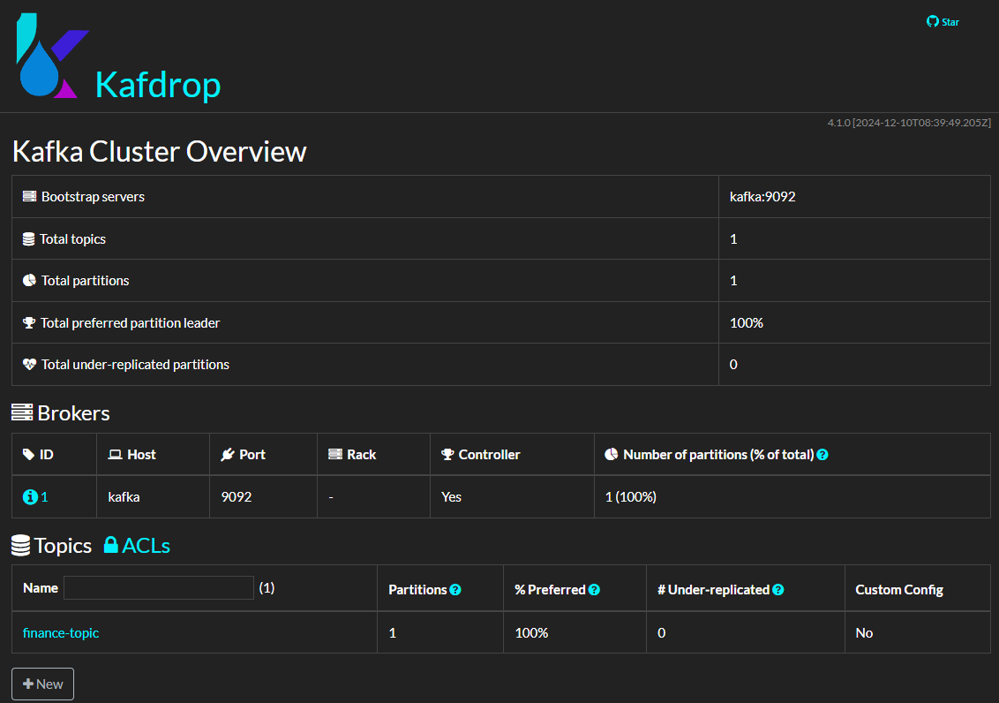
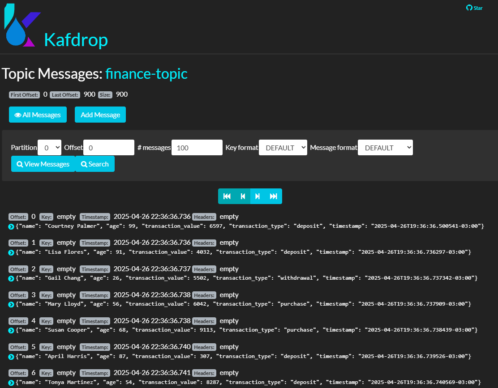

# Kafka Test Pub-Sub

<div align="center">
  
</div>

Este projeto é uma aplicação de testes automatizados para filas de mensageria utilizando Kafka e Python. Ele inclui produtores e consumidores para interagir com os tópicos do Kafka, além de testes para validar as operações.

## Como rodar localmente:

### Requisitos:

- Python 3.11
- Docker e Docker Compose
- Pip (gerenciador de pacotes do Python)

1. **Certifique-se de ter o Docker e o Docker Compose instalados**:
   - [Instalar Docker](https://docs.docker.com/get-docker/)
   - [Instalar Docker Compose](https://docs.docker.com/compose/install/)

2. **Subir o Kafka com Docker**:
   - No diretório raiz do projeto, execute:
     ```bash
     docker-compose up -d
     ```
   - Isso iniciará os serviços do Kafka, Zookeeper e Kafdrop.

3. **Instalar dependências do Python**:
   - Crie e ative um ambiente virtual (opcional, mas recomendado):
     ```bash
     python -m venv venv
     source venv/bin/activate  # No Windows: venv\Scripts\activate
     ```
   - Instale as dependências:
     ```bash
     pip install --upgrade pip
     pip install -r requirements.txt
     ```

4. **Rodar os testes**:
   - Execute os testes com o comando:
     ```bash
     pytest tests/ -s
     ```

5. **Acessar o Kafdrop (opcional)**:
   - O Kafdrop estará disponível em [http://localhost:9000](http://localhost:9000) para visualizar os tópicos e mensagens no Kafka.

<div align="center">
  
</div>

<div align="center">
  
</div>

6. **Parar os serviços do Docker**:
   - Após finalizar os testes, pare os serviços do Docker:
     ```bash
     docker-compose down
     ```

## Estrutura do Projeto:

- **`src/`**: Contém os produtores e consumidores Kafka.
- **`tests/`**: Contém os testes automatizados.
- **`docker-compose.yml`**: Configuração do Kafka, Zookeeper e Kafdrop.
- **`requirements.txt`**: Dependências do projeto.

## Contribuindo
Se você deseja apoiar este projeto, deixe um ⭐.

___

Feito com 💙 por [Marco Antonio](https://www.linkedin.com/in/mrk-silva/).